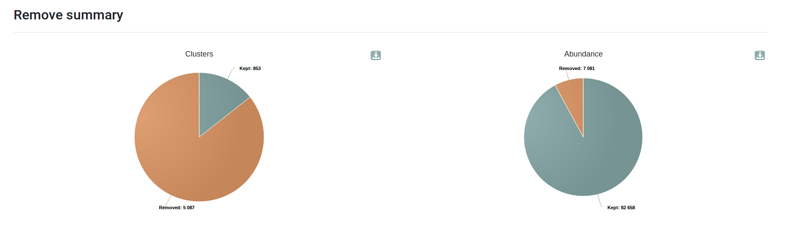
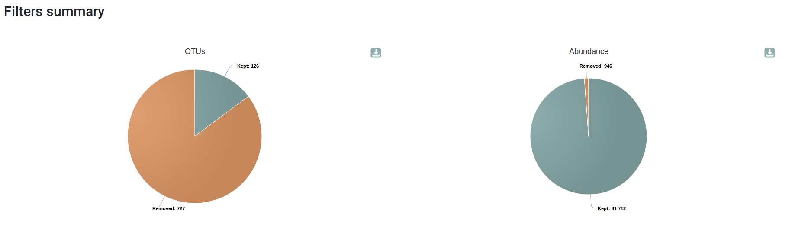
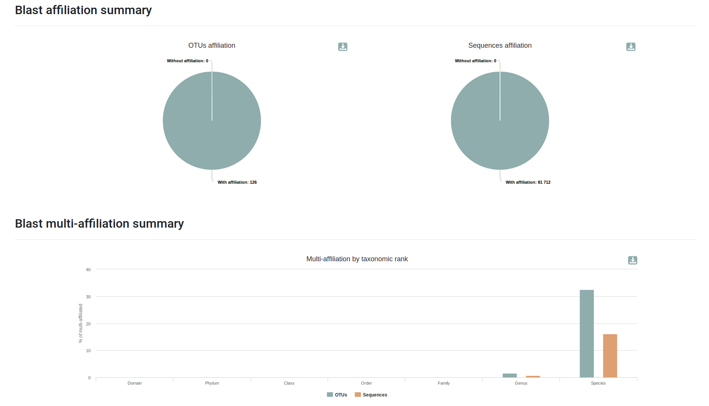
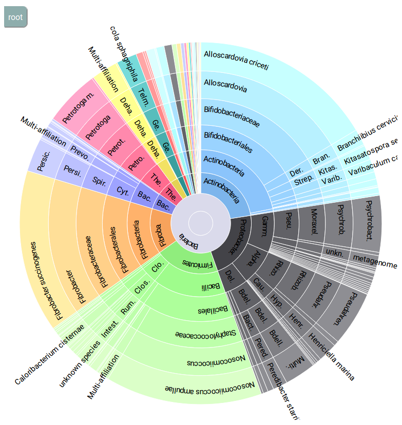
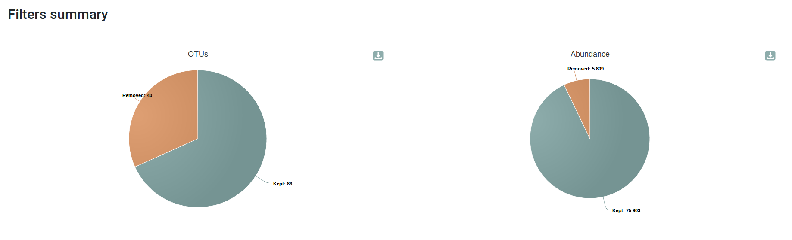
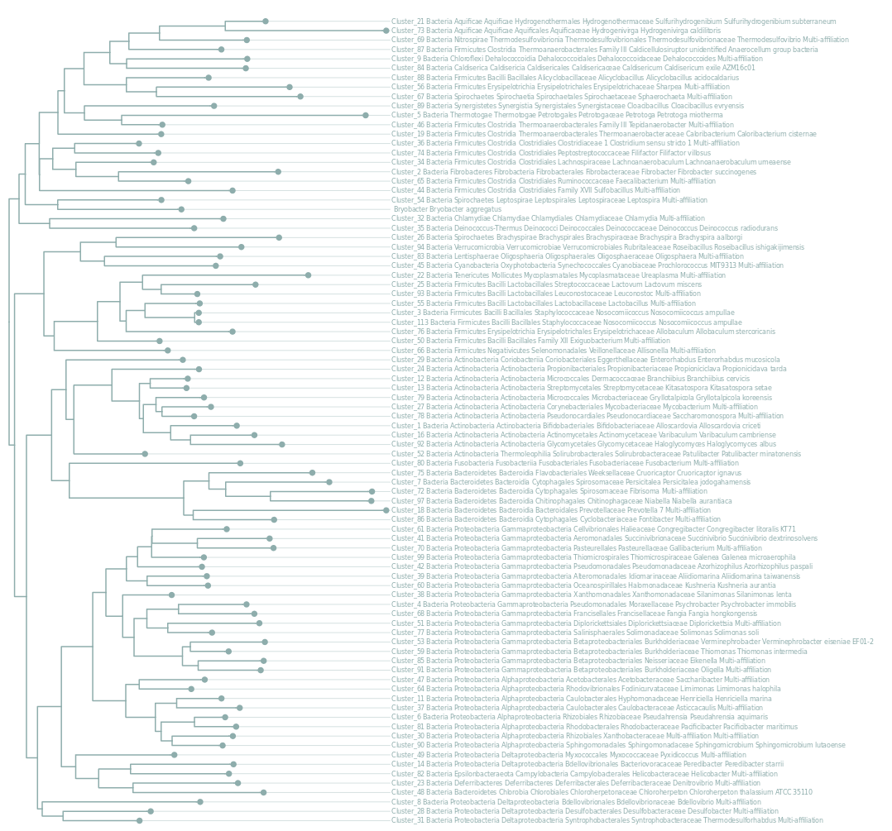

# Introduction
{:.no_toc}

**FROGS**: Find Rapidly OTUs with Galaxy Solution
  - Easy to use for biologists
  - Last updated and adapted tools for better accuracy(16S)
  - Innovativeaffiliation tag to highlight databases conflicts and uncertainties
  - Designedby a group of experts of metagenomics 16S analyses
  - Better accuracy than other tools


> ### Agenda
>
> In this tutorial, we will cover:
>
> 1. TOC
> {:toc}
>
{: .agenda}

# Amplicon metagenomic data analysis with FROGS 

Give some background about what the trainees will be doing in the section.

Below are a series of hand-on boxes, one for each tool in your workflow file.
Often you may wish to combine several boxes into one or make other adjustments such
as breaking the tutorial into sections, we encourage you to make such changes as you
see fit, this is just a starting point :)

Anywhere you find the word "***TODO***", there is something that needs to be changed
depending on the specifics of your tutorial.

have fun!

## Get data

> ###  Hands-on: Data upload
>
> 1. Create a new history for this tutorial
> 2. Import the files from [Zenodo]() or from the shared data library
>
>    ```
>    
>    ```
>    ***TODO***: *Add the files by the ones on Zenodo here (if not added)*
>
>    ***TODO***: *Remove the useless files (if added)*
>
>    
>    
>
> 3. Rename the datasets
> 4. Check the datatype
>
>    
>
> 5. Add to each database a tag corresponding to ...
>
>    
>
{: .hands_on}

# FROGS analysis

It comes first a description of the step: some background and some theory.
Some image can be added there to support the theory explanation:

The idea is to keep the theory description before quite simple to focus more on the practical part.

***TODO***: *Consider adding a detail box to expand the theory*

> ###  More details about the theory
>
> But to describe more details, it is possible to use the detail boxes which are expandable
>
{: .details}

A big step can have several subsections or sub steps:

## FROGS Pre-process

> ###  **FROGS Pre-process merging, denoising and dereplication**
>
>     with the following parameters:
>    * *Sequencer:* `Illumina`
>    * *Input type:* `Archive`
>    *  *"Archive file"*: `100spec_90000seq_9samples.tar.gz` 
>    * *Reads already merged?* `Yes`
>    * *Minimum amplicon size:* `370`
>    * *Maximum amplicon size:* `470`
>    * *Sequencing protocol:* `Illumina Standard`
>    * *5' primer:* `ACGGGAGGCAGCAG`
>    * *3' primer:* `TAGGATTAGATACCCTGGTA`
>
>    > ###  Comment
>    >
>    >Be careful to reverse-complementthe 3’ primer. Indeed, R2 pair has been reverse-complemented during merging process.
>    >
>    >Sequencing platforms often provide you already merged data and raw R1 and R2 paired-end data. Prefer doing the merging process yourself or check the parameters and tools they used. It is very interesting to know how many pairs do not merge.
>    >
>    >If your input sequences have no more primers, choose the Custom protocol in «SequencingProtocol» section. It may happen if the sequencing platform removed primers or if you want to use another tools to pre-process your data.
>    >
>    >If you are not sure of the amplicon size, do not hesitate to check the length distribution graphics to adjust your filters.
>    {: .comment}
>
>    > ###  Outputs
>    >
>    > *  **FROGS Pre-process: report.html**: 
>    > *  **FROGS Pre-process: count.tsv** (49,884 lines):
>    > *  **FROGS Pre-process: dereplicated.fasta** (49,884 sequences):
>    {: .comment}
>
{: .hands_on}


## FROGS Clustering swarm

* A robust and fast clustering method for amplicon-based studies.
* The purpose of swarm is to provide a novel clustering algorithm to handle large
sets of amplicons.
* swarm results are resilient to input-order changes and rely on a small local
linking threshold d, the maximum number of differences between two amplicons.
* swarm forms stable high-resolution clusters, with a high yield of biological
information.

> ###  **FROGS Clustering swarm**
>
>     with the following parameters:
>    -  *"Sequences file"*: `FROGS Clustering swarm: abundance.biom` (output of **FROGS Pre-process** )
>    -  *"Count file"*: `FROGS Clustering swarm: seed_sequences.fasta` (output of **FROGS Pre-process** )
>
>    ***TODO***: *Check parameter descriptions*
>
>    ***TODO***: *Consider adding a comment or tip box*
>
>    > ###  Comment
>    > Swarm make lots of singletons, corresponding to a lot of cluster but few
sequences
>    >
>    >Lots ot clusters are specific of one sample, and have a few sequences (probably
chimera, errors ...)
>    >
>    >The aggregation distance of 3 is particularly adapted with 16S amplicon.
>    >
>    >Do not hesitate to play with this distance and compare final results
>    >
>    >If you have a lot of input sequences, the denoising step is crucial to reduce the
execution time. Its impact on OTU composition is very limited.
>    {: .comment}
>
>    > ###  Outputs
>    > * **FROGS Clustering swarm: swarms_composition.tsv** (5,940 lines):
>    > * **FROGS Clustering swarm: abundance.biom**:
>    > * **FROGS Clustering swarm: seed_sequences.fasta** (5,940 sequences):
>    {: .comment}
>
{: .hands_on}

***TODO***: *Consider adding a question to test the learners understanding of the previous exercise*

> ###  Questions
>
> 1. Question1?
> 2. Question2?
>
> > ###  Solution
> >
> > 1. Answer for question1
> > 2. Answer for question2
> >
> {: .solution}
>
{: .question}

## FROGS Clusters stat

> ###  **FROGS Clusters stat**
>
>     with the following parameters:
>    *  *"Abundance file"*: `abundance_biom` (output of **FROGS Clustering swarm**)
>
>    > ###  Comment
>    >
>    > A comment about the tool or something else. This box can also be in the main text
>    {: .comment}
>
>    > ###  Outputs 
>    > * **FROGS Clusters stat: summary.html**:
>    {: .comment}
{: .hands_on}

***TODO***: *Consider adding a question to test the learners understanding of the previous exercise*

> ###  Questions
>
> 1. Question1?
> 2. Question2?
>
> > ###  Solution
> >
> > 1. Answer for question1
> > 2. Answer for question2
> >
> {: .solution}
>
{: .question}

## FROGS Remove chimera

> ###  FROGS Remove chimera
>
>     with the following parameters:
>    *  *"Sequences file"*: `seed_sequences.fasta` (output of **FROGS Clustering swarm**)
>    * *"Abundance type"*: `BIOM file`
>        -  *"Abundance file"*: `abundance.biom` (output of **FROGS Clustering swarm** )
>
>    ***TODO***: *Check parameter descriptions*
>
>    ***TODO***: *Consider adding a comment or tip box*
>
>    > ###  Comment
>    >Run it after clustering to gain time whitouhout losing sensibility
>    >
>    >Low-abundant OTUs will also be removed with filters. Nevertheless, it is
>    >
>    >important to check the proportion of detected chimeric sequences in your
samples.
>    >
>    >The chimera rate can reach 40% ! It is very dependant to amplicon and
ecosystem composition.
>    {: .comment}
>    >
>    > ###  Outputs
>    > * **FROGS Remove chimera: report.html**:
>    > * **FROGS Remove chimera: non_chimera_abundance.biom** :
>    > * **FROGS Remove chimera: non_chimera.fasta** (853 sequences):
>    {: .comment}
>
{: .hands_on}



***TODO***: *Consider adding a question to test the learners understanding of the previous exercise*

> ###  Questions
>
> 1. Question1?
> 2. Question2?
>
> > ###  Solution
> >
> > 1. Answer for question1
> > 2. Answer for question2
> >
> {: .solution}
>
{: .question}

## FROGS Filters

> ###  **FROGS Filters**
>
>     with the following parameters:
>    *  *"Sequences file"*: `non_chimera_fasta` (output of **FROGS Remove chimera**)
>    *  *"Abundance file"*: `out_abundance_biom` (output of **FROGS Remove chimera*})
>    * *" *** THE FILTERS ON OTUS IN SAMPLES, OTUS SIZE and SEQUENCE PERCENTAGE"*: `Apply filters`
>        - *"Minimum number of samples"*: `3`
>        - *"Minimum proportion/number of sequences to keep OTU"*: `0.00005`
>    * *" *** THE FILTERS ON RDP"*: `No filters`
>    * *" *** THE FILTERS ON BLAST"*: `No filters`
>    * *"Contaminant databank"*: `Apply filters`
>        - *"Contaminant databank"*: ``
>
>    > ###  Comment
>    >
>    > A comment about the tool or something else. This box can also be in the main text
>    {: .comment}
>    >
>    > ###  Outputs
>    > * **FROGS Filters: report.html**:
>    > * **FROGS Filters: excluded.tsv** (723 lines):
>    > * **FROGS Filters: abundance.biom**:
>    > * **FROGS Filters: sequences.fasta** (126 sequences):
>    {: .comment}
>
{: .hands_on}



***TODO***: *Consider adding a question to test the learners understanding of the previous exercise*

> ###  Questions
>
> 1. Question1?
> 2. Question2?
>
> > ###  Solution
> >
> > 1. Answer for question1
> > 2. Answer for question2
> >
> {: .solution}
>
{: .question}

## FROGS Affiliation OTU

> ###  **FROGS Affiliation OTU**
>
>     with the following parameters:
>    * *"Using reference database"*: `silva132 16S pintail100`
>    * *Also perfom RDP assignation?*: `No`
>    *  *"OTU seed sequence"*: `output_fasta` (output of **FROGS Filters**)
>    *  *"Abundance file"*: `output_biom` (output of **FROGS Filters**)
>
>    ***TODO***: *Check parameter descriptions*
>
>    ***TODO***: *Consider adding a comment or tip box*
>
>    > ###  Comment
>    >
>    > A comment about the tool or something else. This box can also be in the main text
>    {: .comment}
>    >
>    > ###  Outputs
>    > * **FROGS Affiliation OTU: report.html**:
>    > * **FROGS Affiliation OTU: affiliation.biom**:
>    {: .comment}
>
{: .hands_on}




***TODO***: *Consider adding a question to test the learners understanding of the previous exercise*

> ###  Questions
>
> 1. Question1?
> 2. Question2?
>
> > ###  Solution
> >
> > 1. Answer for question1
> > 2. Answer for question2
> >
> {: .solution}
>
{: .question}

## FROGS Affiliations stat

> ###  **FROGS Affiliations stat**
>
>     with the following parameters:
>    *  *"Abundance file"*: `affiliation.biom` (output of **FROGS Affiliation OTU** )
>    * *Rarefaction ranks*: `Class Order Family Genus Species`
>    * *"Affiliation processed"*: `FROGS blast`
>
>    ***TODO***: *Check parameter descriptions*
>
>    ***TODO***: *Consider adding a comment or tip box*
>
>    > ###  Comment
>    >
>    > A comment about the tool or something else. This box can also be in the main text
>    {: .comment}
>    >
>    > ###  Outputs
>    > * **FROGS Affiliations stat: summary.html**:
>    {: .comment}
>
{: .hands_on}



***TODO***: *Consider adding a question to test the learners understanding of the previous exercise*

> ###  Questions
>
> 1. Question1?
> 2. Question2?
>
> > ###  Solution
> >
> > 1. Answer for question1
> > 2. Answer for question2
> >
> {: .solution}
>
{: .question}

## FROGS Filters

> ###  **FROGS Filters**
>
>     with the following parameters:
>    *  *"Sequences file"*: `sequences.fasta` (output of **FROGS Filters**)
>    *  *"Abundance file"*: `affiliation.biom` (output of **FROGS Affiliation OTU**)
>    * *" *** THE FILTERS ON OTUS IN SAMPLES, OTUS SIZE and SEQUENCE PERCENTAGE"*: `No filters`
>    * *" *** THE FILTERS ON RDP"*: `No filters`
>    * *" *** THE FILTERS ON BLAST"*: `Apply filters`
>        - *"Minimum identity % (between 0 and 1)"*: `1.0`
>        - *"Minimum coverage % (between 0 and 1)"*: `1.0`
>    * *"Contaminant databank"*: `No filters`
>
>    ***TODO***: *Check parameter descriptions*
>
>    ***TODO***: *Consider adding a comment or tip box*
>
>    > ###  Comment
>    >
>    > A comment about the tool or something else. This box can also be in the main text
>    {: .comment}
>    >
>    > ###  Outputs
>    > * **FROGS Filters: report.html**:
>    > * **FROGS Filters: excluded.tsv** (37 lines):
>    > * **FROGS Filters: abundance.biom**:
>    > * **FROGS Filters: sequences.fasta** (86 sequences):
>    {: .comment}
>
{: .hands_on}



***TODO***: *Consider adding a question to test the learners understanding of the previous exercise*

> ###  Questions
>
> 1. Question1?
> 2. Question2?
>
> > ###  Solution
> >
> > 1. Answer for question1
> > 2. Answer for question2
> >
> {: .solution}
>
{: .question}

## FROGS Tree

> ###  **FROGS Tree**
>
>     with the following parameters:
>    *  *"OTUs sequence file"*: `sequences.fasta` (output of **FROGS Filters** )
>    *  *"Biom file"*: `abundance.biom` (output of **FROGS Filters** )
>
>    > ###  Comment
>    >
>    > A comment about the tool or something else. This box can also be in the main text
>    {: .comment}
>    >
>    > ###  Outputs
>    > * **FROGS Tree: summary.html**:
>    > * **FROGS Tree: tree.nwk** :
>    {: .comment}
>
{: .hands_on}



***TODO***: *Consider adding a question to test the learners understanding of the previous exercise*

> ###  Questions
>
> 1. Question1?
> 2. Question2?
>
> > ###  Solution
> >
> > 1. Answer for question1
> > 2. Answer for question2
> >
> {: .solution}
>
{: .question}

# Conclusion
{:.no_toc}

Sum up the tutorial and the key takeaways here. We encourage adding an overview image of the
pipeline used.