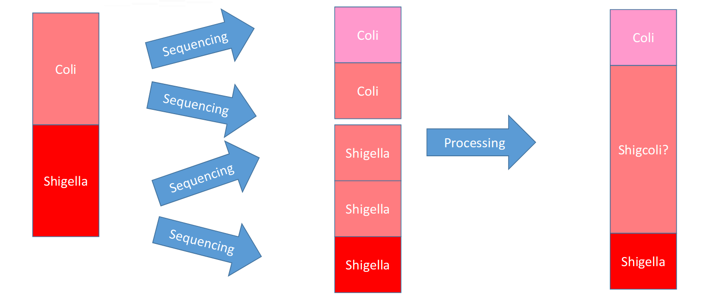
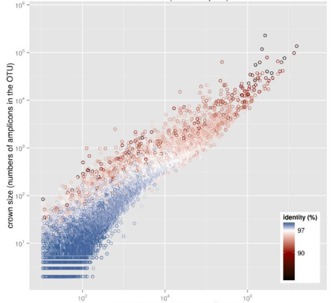
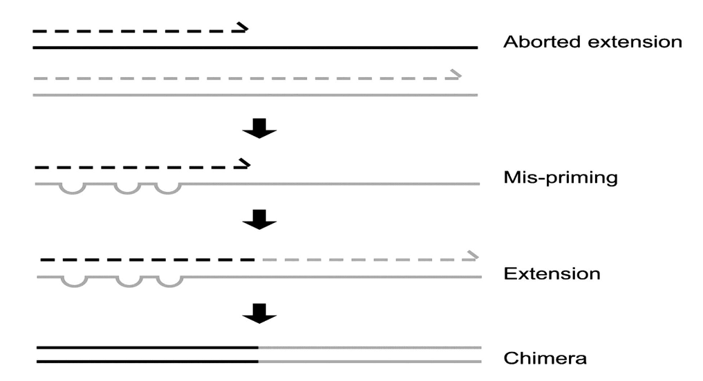

# Overview
{:.no_toc}

**FROGS**: Find Rapidly OTUs with Galaxy Solution
  - Easy to use for biologists
  - Last updated and adapted tools for better accuracy(16S)
  - Innovativeaffiliation tag to highlight databases conflicts and uncertainties
  - Designedby a group of experts of metagenomics 16S analyses
  - Better accuracy than other tools


> ### Agenda
>
> In this tutorial, we will cover:
>
> 1. TOC
> {:toc}
>
{: .agenda}

# Get data

> ###  Hands-on: Data upload
>
> 1. Create a new history for this tutorial
> 2. Import the files from [Zenodo]() or from the shared data library
>
>    ```
>    
>    ```
>    ***TODO***: *Add the files by the ones on Zenodo here (if not added)*
>
>    ***TODO***: *Remove the useless files (if added)*
>
>    
>    
>
> 3. Rename the datasets
> 4. Check the datatype
>
>    
>
> 5. Add to each database a tag corresponding to ...
>
>    
>
{: .hands_on}

# Quality control ?

> ###  **Assess the quality of a FASTQ file**
>
> * Switch to Historynamed "multiplexed" (if needed)
> * Run FastqCon dataset multiplexed.fastq
> * Explore the HTML report
>
{: .hands_on}

> ###  Questions
>
>   1. How many sequences in file ?
>   2. Sequence length range ?
>   3. Length of the majority of sequences?
>   4. Can you explain the graphic named "Per base sequence quality" ?
>
>   > ###  Solution
>   >
>   > 1. Answer for question1
>   > 2. Answer for question2
>   >
>   {: .solution}
>
{: .question}

# Demultiplexing ?


# FROGS analysis

It comes first a description of the step: some background and some theory.
Some image can be added there to support the theory explanation:

The idea is to keep the theory description before quite simple to focus more on the practical part.

***TODO***: *Consider adding a detail box to expand the theory*

> ###  More details about the theory
>
> But to describe more details, it is possible to use the detail boxes which are expandable
>
{: .details}

A big step can have several subsections or sub steps:

## Clean extended fragments and dereplicate

We have here Illumina data, 2x250 bp. The amplicon is the 16S V3-V4 region (min : 320 bp, max : 430 bp, 90% of fragments < 390 bp).
The primers are :
* 5’ CCGTCAATTC
* 3’ CCGCNGCTGCT

> ###  **FROGS Pre-process denoising and dereplication**
>
>     with the following parameters:
>    * *Sequencer:* `Illumina`
>    * *Input type:* `Archive`
>    *  *"Archive file"*: `100spec_90000seq_9samples.tar.gz` 
>    * *Reads already merged?* `Yes`
>    * *Minimum amplicon size:* `370`
>    * *Maximum amplicon size:* `470`
>    * *Sequencing protocol:* `Illumina Standard`
>    * *5' primer:* `ACGGGAGGCAGCAG`
>    * *3' primer:* `TAGGATTAGATACCCTGGTA`
>
>    > ###  Comment
>    >
>    > Be careful to reverse-complementthe 3’ primer. Indeed, R2 pair has been reverse-complemented during merging process.
>    >
>    > Sequencing platforms often provide you already merged data and raw R1 and R2 paired-end data. Prefer doing the merging process yourself or check the parameters and tools they used. It is very interesting to know how many pairs do not merge.
>    >
>    > If your input sequences have no more primers, choose the Custom protocol in "SequencingProtocol" section. It may happen if the sequencing platform removed primers or if you want to use another tools to pre-process your data.
>    >
>    > If you are not sure of the amplicon size, do not hesitate to check the length distribution graphics to adjust your filters.
>    {: .comment}
>
>    > ###  Outputs
>    >
>    > *  **FROGS Pre-process: report.html**: 
>    > *  **FROGS Pre-process: count.tsv** (49,884 lines):
>    > *  **FROGS Pre-process: dereplicated.fasta** (49,884 sequences):
>    {: .comment}
>
{: .hands_on}

> ###  Questions
>
> 1. How many sequences are remaining?
> 2. Why this number does not correspond to the number of sequences in the FASTA file "dereplicated.fasta" ?
> 3. Why is the file "count.tsv" very important ?
> 4. How can you perform your first comparison of samples/replicates ?
>
> > ###  Solution
> >
> > 1. Answer for question1
> > 2. Answer for question2
> >
> {: .solution}
>
{: .question}


## Group cleaned sequences into OTUs

We need a method to group sequences to adress biological biases.



Gene copy number spans over an order of magnitude, from 1 to up to 15 in Bacteria, but only up to 5 in Archaea
Only a minority of bacterial genomes harbors identical 16S rRNA gene copies
Sequence diversity increases with increasing copy numbers. 
While certain taxa harbor dissimilar 16S rRNAgenes, others contain sequences common to multiple species.

* Variable number of 16S gene copies
* Sequence diversity among the same organism
* Some 16S sequences are common to multiple species, and sequence diversity differs among phyla

Why do we need Swarm clustering ?

* A robust and fast clustering method for amplicon-based studies.
* The purpose of swarm is to provide a novel clustering algorithm to handle large sets of amplicons.
* Swarm results are resilient to input-order changes and rely on a small local linking threshold d, the maximum number of differences between two amplicons.
* Swarm forms stable high-resolution clusters, with a high yield of biological information.

Abundant sequences/OTU are clustered at 90% ID, small OUT are clustered > 97% ID



> ###  **FROGS Clustering swarm**
>
>     with the following parameters:
>    -  *"Sequences file"*: `FROGS Clustering swarm: abundance.biom` (output of **FROGS Pre-process** )
>    -  *"Count file"*: `FROGS Clustering swarm: seed_sequences.fasta` (output of **FROGS Pre-process** )
>
>    > ###  Comment
>    > Swarm make lots of singletons, corresponding to a lot of cluster but few sequences.
>    >
>    > Lots ot clusters are specific of one sample, and have a few sequences (probably chimera, errors ...)
>    >
>    > The aggregation distance of 3 is particularly adapted with 16S amplicon.
>    >
>    > Do not hesitate to play with this distance and compare final results
>    >
>    > If you have a lot of input sequences, the denoising step is crucial to reduce the execution time. Its impact on OTU composition is very limited.
>    {: .comment}
>
>    > ###  Outputs
>    > * **FROGS Clustering swarm: swarms_composition.tsv** (5,940 lines):
>    > * **FROGS Clustering swarm: abundance.biom**:
>    > * **FROGS Clustering swarm: seed_sequences.fasta** (5,940 sequences):
>    {: .comment}
>
{: .hands_on}

> ###  **FROGS Clusters stat**
>
>     with the following parameters:
>    *  *"Abundance file"*: `abundance_biom` (output of **FROGS Clustering swarm**)
>
>    > ###  Comment
>    >
>    >
>    {: .comment}
>
>    > ###  Outputs 
>    > * **FROGS Clusters stat: summary.html**:
>    {: .comment}
{: .hands_on}

> ###  Questions
>
> 1. How many OTUs are formed?
> 2. What is the length of the majority of cleaned sequences ?
> 3. What can we say by observing the sequence distribution ?
> 4. How many sequences are in the biggest OTU ?
> 5. According to the experimental design, how to interpret shared and own clusters ?
> 6. How do you interpret hierarchical clustering ?
>
> > ###  Solution
> >
> > 1. Answer for question1
> > 2. Answer for question2
> >
> {: .solution}
>
{: .question}

## Detect and remove chimera

* Up to 70% of chimeric sequences in the unique amplicon pool of PCR-amplified samples
* Chimera: from 5 to 45% of reads



But how can we identify Chimera ?

* Reference based: against a database of "genuine" sequences
* De novo: against abundant sequences in the samples
* Using a smart experimental design (when available)

In several cases, the inferred number of OTUs largely exceeded the total number of cells in the samples.
Such inflation of the OTU numbers corresponded to ‘rare biosphere’ taxa, composed largely of artifacts. 
In general, chimera detection removes many low abundance OTUs.
Many SOP recommend abundance filters.

> ###  FROGS Remove chimera
>
>     with the following parameters:
>    *  *"Sequences file"*: `seed_sequences.fasta` (output of **FROGS Clustering swarm**)
>    * *"Abundance type"*: `BIOM file`
>        -  *"Abundance file"*: `abundance.biom` (output of **FROGS Clustering swarm** )
>
>    ***TODO***: *Check parameter descriptions*
>
>    ***TODO***: *Consider adding a comment or tip box*
>
>    > ###  Comment
>    > Run it after clustering to gain time whitouhout losing sensibility
>    >
>    > Low-abundant OTUs will also be removed with filters. Nevertheless, it is
>    >
>    > Important to check the proportion of detected chimeric sequences in your samples.
>    >
>    > The chimera rate can reach 40% ! It is very dependant to amplicon and ecosystem composition.
>    {: .comment}
>    >
>    > ###  Outputs
>    > * **FROGS Remove chimera: report.html**:
>    > * **FROGS Remove chimera: non_chimera_abundance.biom** :
>    > * **FROGS Remove chimera: non_chimera.fasta** (853 sequences):
>    {: .comment}
>
{: .hands_on}


***TODO***: *Consider adding a question to test the learners understanding of the previous exercise*

> ###  Questions
>
> 1. Question1?
> 2. Question2?
>
> > ###  Solution
> >
> > 1. Answer for question1
> > 2. Answer for question2
> >
> {: .solution}
>
{: .question}

## Apply filters on abundance and contamination

How can we suppress some of the remaining artefacts ?
Why filtering ?

Considering that:
* low abundant sequences are often chimeric
* it is impossible to distinguish rare biosphere and artefacts
* we have better accuracy after removing singletons
* we can use replicates to keep good OTUs
* affiliation runs long time ! Faster without singleton 

That's why we used FROGS filters to keep only OTUs present in at least 3 samples, and with a min relative abundanceof 0.00005.

> ###  **FROGS Filters**
>
>     with the following parameters:
>    *  *"Sequences file"*: `non_chimera_fasta` (output of **FROGS Remove chimera**)
>    *  *"Abundance file"*: `out_abundance_biom` (output of **FROGS Remove chimera*})
>    * *" *** THE FILTERS ON OTUS IN SAMPLES, OTUS SIZE and SEQUENCE PERCENTAGE"*: `Apply filters`
>        - *"Minimum number of samples"*: `3`
>        - *"Minimum proportion/number of sequences to keep OTU"*: `0.00005`
>    * *" *** THE FILTERS ON RDP"*: `No filters`
>    * *" *** THE FILTERS ON BLAST"*: `No filters`
>    * *"Contaminant databank"*: `Apply filters`
>        - *"Contaminant databank"*: ``
>
>    > ###  Comment
>    >
>    > A comment about the tool or something else. This box can also be in the main text
>    {: .comment}
>    >
>    > ###  Outputs
>    > * **FROGS Filters: report.html**:
>    > * **FROGS Filters: excluded.tsv** (723 lines):
>    > * **FROGS Filters: abundance.biom**:
>    > * **FROGS Filters: sequences.fasta** (126 sequences):
>    {: .comment}
>
{: .hands_on}


***TODO***: *Consider adding a question to test the learners understanding of the previous exercise*

> ###  Questions
>
> 1. How many OTUs are remaining ? How many sequences ?
> 2. What is the size of the smallest OTU ?
> 3. Which information shows that this process is very important ?
>
> > ###  Solution
> >
> > 1. Answer for question1
> > 2. Answer for question2
> >
> {: .solution}
>
{: .question}

## Assign OTUs using reference databank

What can we do if several species have the same 16S gene ?

IMAGE (p208)

Run FROGS Affiliation OTU using blast only on Silva 132 pintail 100 databank

> ###  **FROGS Affiliation OTU**
>
>     with the following parameters:
>    * *"Using reference database"*: `silva132 16S pintail100`
>    * *Also perfom RDP assignation?*: `No`
>    *  *"OTU seed sequence"*: `output_fasta` (output of **FROGS Filters**)
>    *  *"Abundance file"*: `output_biom` (output of **FROGS Filters**)
>
>    > ###  Comment
>    >
>    > * A lot of databanks are available for affiliating OTUs
>    > * A multi-affiliation is not a bad affiliation! The amplicon sequence maybe identic. Choosing one randomly is not a good choice.
>    > * If you want to use an home-made databank (or one not availableyet), contact us to add it. You cannot add it by yourself.
>    > * Your knowledge of the studied ecosystem can permit you to detect errors in affiliation.
>    {: .comment}
>    >
>    > ###  Outputs
>    > * **FROGS Affiliation OTU: report.html**:
>    > * **FROGS Affiliation OTU: affiliation.biom**:
>    {: .comment}
>
{: .hands_on}


> ###  Questions
>
> 1. How many sequences are affiliated by blast ?
> 2. How do you understand the "Multi-affiliation by taxonomicrank" graphic?
> 2. Question2?
>
> > ###  Solution
> >
> > 1. Answer for question1
> > 2. Answer for question2
> >
> {: .solution}
>
{: .question}

Run FROGS Affiliations stat

> ###  **FROGS Affiliations stat**
>
>     with the following parameters:
>    *  *"Abundance file"*: `affiliation.biom` (output of **FROGS Affiliation OTU** )
>    * *Rarefaction ranks*: `Class Order Family Genus Species`
>    * *"Affiliation processed"*: `FROGS blast`
>
>    > ###  Comment
>    >
>    > A comment about the tool or something else. This box can also be in the main text
>    {: .comment}
>    >
>    > ###  Outputs
>    > * **FROGS Affiliations stat: summary.html**:
>    {: .comment}
>
{: .hands_on}


## Filter OTUs by keeping only those with a perfect alignment on full-length sequence

Do not forget, with filter tool we can filter the data based on their affiliation.

> ###  **FROGS Filters**
>
>     with the following parameters:
>    *  *"Sequences file"*: `sequences.fasta` (output of **FROGS Filters**)
>    *  *"Abundance file"*: `affiliation.biom` (output of **FROGS Affiliation OTU**)
>    * *" *** THE FILTERS ON OTUS IN SAMPLES, OTUS SIZE and SEQUENCE PERCENTAGE"*: `No filters`
>    * *" *** THE FILTERS ON RDP"*: `No filters`
>    * *" *** THE FILTERS ON BLAST"*: `Apply filters`
>        - *"Minimum identity % (between 0 and 1)"*: `1.0`
>        - *"Minimum coverage % (between 0 and 1)"*: `1.0`
>    * *"Contaminant databank"*: `No filters`
>
>    > ###  Comment
>    >
>    > A comment about the tool or something else. This box can also be in the main text
>    {: .comment}
>    >
>    > ###  Outputs
>    > * **FROGS Filters: report.html**:
>    > * **FROGS Filters: excluded.tsv** (37 lines):
>    > * **FROGS Filters: abundance.biom**:
>    > * **FROGS Filters: sequences.fasta** (86 sequences):
>    {: .comment}
>
{: .hands_on}


***TODO***: *Consider adding a question to test the learners understanding of the previous exercise*

> ###  Questions
>
> 1. How many clusters are remaning ?
>
> > ###  Solution
> >
> > 1. Answer for question1
> > 2. Answer for question2
> >
> {: .solution}
>
{: .question}

## Create a phylogentic tree from sequences

Why a phylogenetic tree ?

With Phyloseq, you will be able to compute unifrac distances, based on a phylogenetic tree.
When you do sequences alignement with Frogs, you have two options:
* With a template: Pynast
    - faster
    - Sequences must have >= 75% ID with template or are discarded
* Without template: Mafft
    - Longer
    - Takes into account all sequences 

You can then build a Tree, this is a fast building limited to 10 000 sequences.

> ###  **FROGS Tree**
>
>     with the following parameters:
>    *  *"OTUs sequence file"*: `sequences.fasta` (output of **FROGS Filters** )
>    *  *"Biom file"*: `abundance.biom` (output of **FROGS Filters** )
>
>    > ###  Comment
>    >
>    > A comment about the tool or something else. This box can also be in the main text
>    {: .comment}
>    >
>    > ###  Outputs
>    > * **FROGS Tree: summary.html**:
>    > * **FROGS Tree: tree.nwk** :
>    {: .comment}
>
{: .hands_on}


***TODO***: *Consider adding a question to test the learners understanding of the previous exercise*

> ###  Questions
>
> 1. Question1?
> 2. Question2?
>
> > ###  Solution
> >
> > 1. Answer for question1
> > 2. Answer for question2
> >
> {: .solution}
>
{: .question}

# Conclusion
{:.no_toc}

Sum up the tutorial and the key takeaways here. We encourage adding an overview image of the
pipeline used.